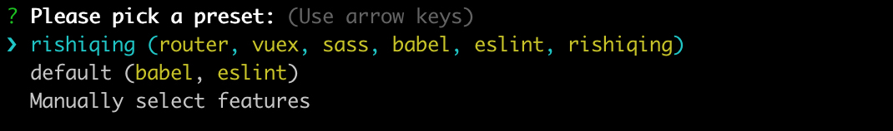
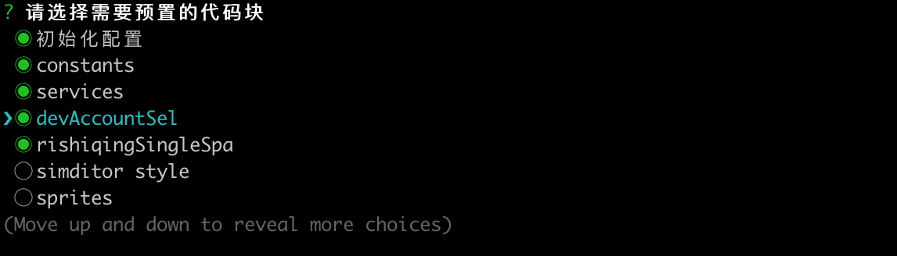
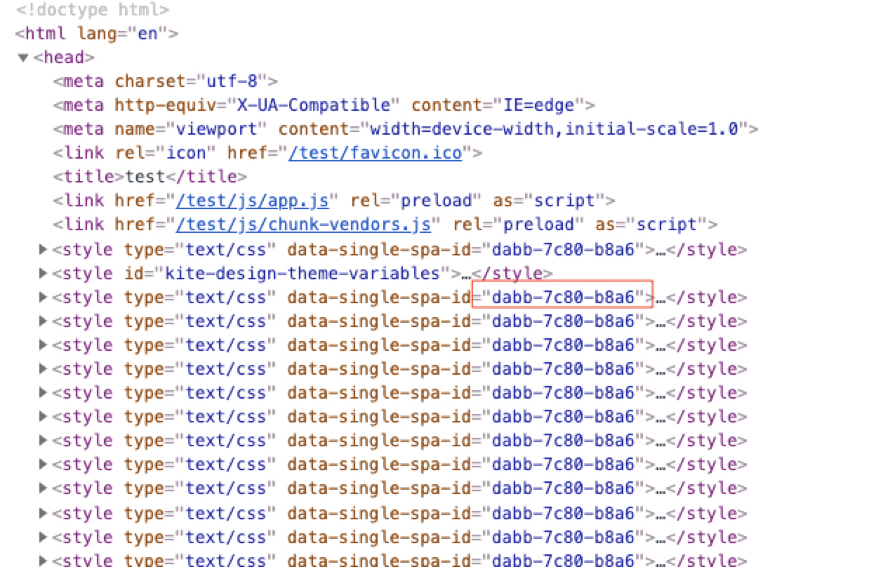

## rishiqingSingleSpa项目初始化配置

### 初始化rishiqingSingleSpa项目

假设你要初始化一个项目叫: rishiqing-kanban

```shell
vue create rishiqing-kanban
```

根据提示，选择`rishiqing`这个preset，然后回车



之后就会进入自动安装依赖包，安装完成之后，vue-cli会自动invoke vue-cli-plugin-rishiqing，然后根据提示，选择对应的预置代码：



在默认勾选的几个配置上，再勾选上 `rishiqingSingleSpa`，余下的根据需求选择，然后按回车

接下来就是根据插件的提示，填写CDN, 项目地址前缀, 调试端口, 然后插件会自动进一步安装所需依赖，以及生成默认代码。


### 开发环境

#### RISHIQING_SINGLE_SPA

项目初始化之后，在`.env.*`文件里，会预置一个名为`RISHIQING_SINGLE_SPA`的环境变量，这个环境变量的值可配置为`true`或者`false`。

`RISHIQING_SINGLE_SPA`为true，表示应用打包的时候，会打包成一个微应用，必须要接入主工程之后才能使用

`RISHIQING_SINGLE_SPA`为false，表示应用还是按照常规打包，方便单独开发调试

`.env.beta`和`.env.release`里的`RISHIQING_SINGLE_SPA`都默认为`true`

`.env.local`里的`RISHIQING_SINGLE_SPA` 默认为`false`

而我们的开发环境，主要是根据`RISHIQING_SINGLE_SPA`来区分的，为`true`的时候，就开启微应用模式，为`false`的时候，就开启普通模式

#### 微应用模式

当`.env.*`文件里的`RISHIQING_SINGLE_SPA`置为`true`的时候，就会开启微应用模式。开启微应用模式，会做如下特殊处理

##### 删掉html相关插件

```js
api.chainWebpack((webpackChain) => {
  webpackChain.plugins.delete('html')
  webpackChain.plugins.delete('preload')
  webpackChain.plugins.delete('prefetch')
})
```

会删掉和index.html有关的插件，在微应用模式下，我们不需要html文件作为入口

##### 修改js入口文件

```js
webpackConfig.entry = {
  app: './src/main.js',
}
webpackConfig.output.filename = '[name].js'
```

把entry统一配置为 `./src/main.js`，且生成一个名为app.js的文件。

假设你在初始化项目的时候，项目地址前缀，也就是`.env.*`文件里的BASE_URL填的是 `/app/kanban`，项目运行起来的端口是 3001，那么这个微应用的js文件的路径就是: http://localhost:3001/app/kanban/app.js

##### 禁止掉runtimeChunk和splitChunks

```js
webpackConfig.optimization = {
  runtimeChunk: false,
  splitChunks: false,
}
```

##### 使用webpackSystemRegister处理一些特殊包

```js
webpackConfig.plugins.push(new WebpackSystemRegister({
  systemjsDeps: [
    /^share-data/,
  ],
}))
```


#### 普通模式

##### 颜色变量引入

普通模式下，会引入kite-design的主题颜色变量，以及对应的rgb变量：

```css
:root {
  /* 主题色变量 */
  --kite-theme-color-1: #f0f9ff;
  --kite-theme-color-1-rgb: 240, 249, 255;
  --kite-theme-color-2: #cfeaff;
  --kite-theme-color-2-rgb: 207, 234, 255;
  --kite-theme-color-3: #a6d5ff;
  --kite-theme-color-3-rgb: 166, 213, 255;
  --kite-theme-color-4: #7dbeff;
  --kite-theme-color-4-rgb: 125, 190, 255;
  --kite-theme-color-5: #54a4ff;
  --kite-theme-color-5-rgb: 84, 164, 255;
  --kite-theme-color-6: #2b88fe;
  --kite-theme-color-6-rgb: 43, 136, 254;
  --kite-theme-color-7: #1a66d9;
  --kite-theme-color-7-rgb: 26, 102, 217;
  --kite-theme-color-8: #0c49b3;
  --kite-theme-color-8-rgb: 12, 73, 179;
  --kite-theme-color-9: #03318c;
  --kite-theme-color-9-rgb: 3, 49, 140;
  --kite-theme-color-10: #011f66;
  --kite-theme-color-10-rgb: 1, 31, 102;
  
  /* 错误色变量 */
  --kite-error-color-1: #fff1f0;
  --kite-error-color-1-rgb: 255, 241, 240;
  --kite-error-color-2: #ffccc7;
  --kite-error-color-2-rgb: 255, 204, 199;
  --kite-error-color-3: #ffa39e;
  --kite-error-color-3-rgb: 255, 163, 158;
  --kite-error-color-4: #ff7875;
  --kite-error-color-4-rgb: 255, 120, 117;
  --kite-error-color-5: #ff4d4f;
  --kite-error-color-5-rgb: 255, 77, 79;
  --kite-error-color-6: #f5222d;
  --kite-error-color-6-rgb: 245, 34, 45;
  --kite-error-color-7: #cf1322;
  --kite-error-color-7-rgb: 207, 19, 34;
  --kite-error-color-8: #a8071a;
  --kite-error-color-8-rgb: 168, 7, 26;
  --kite-error-color-9: #820014;
  --kite-error-color-9-rgb: 130, 0, 20;
  --kite-error-color-10: #5c0011;
  --kite-error-color-10-rgb: 92, 0, 17;
}
```

开发中，可直接使用这几个颜色变量

还引入了kite-design的4个功能色变量，以及对应的rgb变量：

```css
:root {
  --kite-func-color-link: #2B88FE;
  --kite-func-color-link-rgb: 43, 136, 254;
  --kite-func-color-success: #51C419;
  --kite-func-color-success-rgb: 81, 196, 25;
  --kite-func-color-warn: #FAAD15;
  --kite-func-color-warn-rgb: 250, 173, 21;
  --kite-func-color-error: #F5222D;
  --kite-func-color-error-rgb: 245, 34, 45;
}
```

##### normalize.css

引入了[normalize.css](https://www.npmjs.com/package/normalize.css)@8.0.1来重置各浏览器的样式区别，所以就不用在项目里单独引入了。

如果项目是用旧版vue-cli-plugin-rishiqing插件初始化的，更新插件之后，需要把之前引入的normalize.css给去掉.

##### 全局变量

`RISHIQING_SINGLE_SPA`，true/false，表示是否是在微应用模式

`ROUTER_BASE`，字符串，表示项目的地址前缀，主要用在router.js里的base


### 获取用户基础数据

获取用户的基础数据主要分两种情况：

1、微应用模式     2、普通模式

#### 微应用模式

这种模式下，应用需要接入到主工程里才能使用，用户的基础数据可以从主工程提供的`share-data`获取

```js
const data = {}
const ShareData = require('share-data')
const basicData = ShareData.getBasicData()
data.USER_INFO = basicData.USER_INFO
data.USER_TREE = basicData.USER_TREE || []
```


#### 普通模式

普通模式，也就是我们通常用的调试环境，由于没有接入到主工程，没有`share-data`可用，所以使用账号密码登录或者token来获取用户信息

```js
const password = window.localStorage.getItem('dev-account-password')
const username = window.localStorage.getItem('dev-account-username')
const token = window.localStorage.getItem('dev-account-token')
if (token) {
  service.defaults.headers.token = token
}
// 获取用户数据
let userInfo
if (token) {
  userInfo = await loadUserInfo()
} else {
  userInfo = await login(username, password)
}

// 获取部门数据
const userTree = await loadDeptList()
```

从代码可以看到，我们利用了我们的账号调试。当配置了token，会优先使用token，如果没有配置token，则会使用账号和密码


#### 整合两种模式

为了在两种模式下都能非常方便的获取到用户基础数据，新增`lib/single-spa-data.js `用来处理用户的基础数据。

上demo:

在main.js里初始化数据：

```js
import {
  initData,
} from 'rishiqing/single-spa-data'

async function init() {
  // 先初始化数据，需要注意，initData是一个异步函数
  await initData()
  new Vue({
    router,
    store,
    i18n,
    render: h => h(App),
  }).$mount('#app')
}

if (!RISHIQING_SINGLE_SPA) {
  init()
}
```


在其他组件里使用数据：

```vue
<script>
import {
  getUserInfo,
  getToken,
  getDeptList,
  getUnfoldDeptList,
  getUserList,
  getFreshTime,
  getCurrentUserCompanyAuthorities,
  getDeptListByIds,
  getUserListByIds,
  getUnDept,
  getParentIdListByDeptIdList,
  getMessageClient,
  getSystemConfig,
  findUserById,
  findDeptById,
  
  isVip,
  isZyVipOrMore,
  isQyVipOrMore,
  isUltimateVipOrMore,
  
  openPayPage,
  openPayDetail,
} from 'rishiqing/single-spa-data'

export default {
  async mounted() {
    // 获取用户的基本信息
    const userInfo = getUserInfo()
    // 获取用户的token
    const token = getToken()
    // 获取部门树
    const deptList = getDeptList()
    // 获取部门列表
    const unfoldDeptList = getUnfoldDeptList()
    // 获取成员列表
    const userList = getUserList()
    // 获取freshTime
    const freshTime = getFreshTime()
    // 获取当前用户公司层面的权限
    // 需要注意这个方法返回的是Promise，每次调用都会直接发起请求
    const auth = await getCurrentUserCompanyAuthorities()
    // 通过部门的id列表，获取部门的详细数据列表
    const deptList = getDeptListByIds([1, 2, 3])
    // 通过成员的id列表，获取成员的详细数据列表
    const userList = getUserListByIds([1, 2, 3])
    // 获取未分配部门
    const undept = getUnDept()
    // 通过部门的id列表，获取对应部门的所有父级部门的id列表
    const parentIdList = getParentIdListByDeptIdList([1, 2, 3])
    // 获取rishiqing-front的消息客户端
    const messageClient = getMessageClient()
    // 获取系统配置数据，用于做平台区分处理以及其他第三方等配置数据
    const systemConfig = getSystemConfig()
    // 通过成员的id查找到成员详细数据
    const user = findUserById('123')
    // 通过部门id，查找到部门的详细数据
    const dept = findDeptById('123')
    
    // 是否是会员
    const vip = isVip()
    // 是否是专业或者以上会员
    const zyVipOrMore = isZyVipOrMore()
    // 是否是企业或者以上会员
    const qyVipOrMore = isQyVipOrMore()
    // 是否是旗舰或者以上会员
    const ultimateVipOrMore = isUltimateVipOrMore()
    
    // 打开版本升级页面
    openPayPage()
    // 打开付费详情页面.
    // buyType为想要购买的版本类型(ZY: 专业版, QY: 企业版, QJ: 旗舰版), 不区分大小写.如果不传buyType，则默认为续费操作
    openPayDetail(buyType)
  }
}
</script>
```

##### 消息客户端使用

> 现在消息客户端只有接入到rishiqing-front的时候才能正常监听到message事件
>
> 在普通开发模式下，getMessageClient()只会返回一个事件对象，但是不会触发message事件
>
> getMessageClient()返回的是一个 eventemitter3 初始化的事件对象，具体使用方式，可查看 [eventemitter3](https://www.npmjs.com/package/eventemitter3)的文档

```vue
<script>
import {
  getMessageClient,
} from 'rishiqing/single-spa-data'
  
export default {
  mounted() {
    // 监听 message 事件
    getMessageClient().on('message', this.onMessageHandle)
  },
  methods: {
    onMessageHandle(data) {
      console.log('data', data)
    },
  },
  beforeDestroy() {
    // 记得随时销毁监听，避免造成内存泄漏
    getMessageClient().off('message', this.onMessageHandle)
  }
}
</script>
```

##### systemConfig系统配置数据

> 在接入到rishiqing-front之后，getSystemConfig()返回的是 rishiqing-front里的systemConfig数据
>
> 在普通开发模式下，默认情况 getSystemConfig() 只会返回一个空对象 {}
>
> 但如果为了调试，可以在项目根目录下新建一个 `system-config.json` 文件，之后调用 getSystemConfig() 就会返回 ``system-config.json`` 里配置的json数据了

> 注： ``system-config.json``文件修改之后，不用重启webpack，刷新页面即可生效

数据参考:

```json
{
  "platform": "rishiqing",
  "name": "日事清",
  "sentry": {},
  "growingIo": {},
  "kf": {},
  "aliStatistics": {},
  "function": {
    "archive": true,
    "tomato": true,
    "search": true
  }
}
```


使用参考：

```vue
<script>
import {
  getSystemConfig,
} from 'rishiqing/single-spa-data'
  
export default {
  mounted() {
    if (getSystemConfig().platform === 'rishiqing') {
      console.log('日事清')
    }
    if (getSystemConfig().platform === 'workbei') {
      console.log('功倍')
    }
  },
}
</script>
```


### 样式销毁 & 插入

在多个singleSpa应用之间切换的时候，singleSpa初始化插入的style标签并不能自动销毁和插入，而是会永久留在head标签里，这样会导致多个singleSpa应用的样式代码相互影响。需要想办法，在singleSpa应用销毁的时候，同时也销毁它引进的style，在singleSpa挂载的时候，又重新插入style。


#### 解决方案

在每个singleSpa构建的时候，会随机生成一个字符串，格式为：`xxxx-xxxx-xxxx`，这个字符串会作为属性`data-single-spa-id`的值，设置到style标签上，dom结构大致如下:



这样可以实现不同的singleSpa，在往dom里插入style的时候，都会带上一个属性，名为: `data-single-spa-id`，值为一个随机数，只要在singleSpa挂载和销毁的时候，通过这个属性找到对应的style列表，然后进行灵活的移除和插入即可

这个随机数的值做成了一个全局变量：`SINGLE_SPA_ID`


#### 已有项目如何实现样式切换

第一步：更新vue-cli-plugin-rishiqing到最新版

第二步：在src/singleSpa.js文件里加入两个方法

```js
let styleCache

function addStyle() {
  try {
    const head = document.querySelector('head')
    if (styleCache) {
      styleCache.forEach((style) => {
        head.appendChild(style)
      })
    }
  } catch (error) {
    // eslint-disable-next-line no-console
    console.error(error)
  }
}

function removeStyle() {
  // 移除掉所有的style
  try {
    styleCache = [...document.querySelectorAll(`style[data-single-spa-id="${SINGLE_SPA_ID}"]`)]
    styleCache.forEach((style) => {
      style.parentNode.removeChild(style)
    })
  } catch (error) {
    // eslint-disable-next-line no-console
    console.error(error)
  }
}
```

第三步：在mount里调用addStyle, 在unmount里调用removeStyle

```js
// singleSpa 挂载函数
export async function mount(props) {
  // 调用addStyle
  addStyle()
  await init()
  vueContainer = new Vue({
    router,
    store,
    i18n,
    render: h => h(App),
  }).$mount()

  const el = document.querySelector(`#${props.containerId}`)
  el.appendChild(vueContainer.$el)
}

// singleSpa 卸载函数
export async function unmount() {
  if (vueContainer) {
    vueContainer.$destroy()
    if (vueContainer.$el.parentElement) {
      vueContainer.$el.parentElement.removeChild(vueContainer.$el)
    }
  }
  // 调用removeStyle
  removeStyle()
}
```

第四步：完善.eslintrc.js的globals配置

```json
globals: {
  RISHIQING_SINGLE_SPA: true,
  ROUTER_BASE: true,
  __DEV__: true,
  KITE_DESIGN_THEME_COLOR: true,
  R_URL: true,
  SINGLE_SPA_ID: true,
},
```

第五步：重启，完成

#### 新项目如何实现样式切换

直接用最新的vue-cli-plugin-rishiqing初始化项目即可，开箱即用